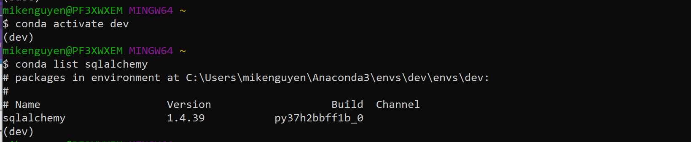
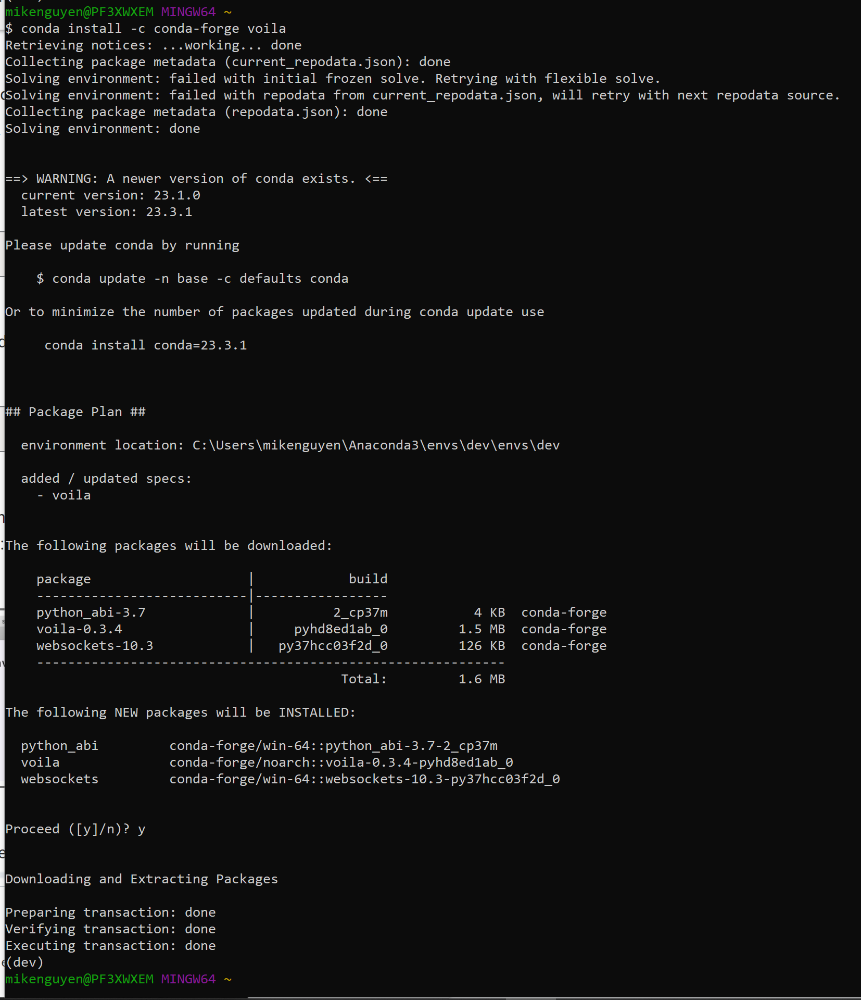
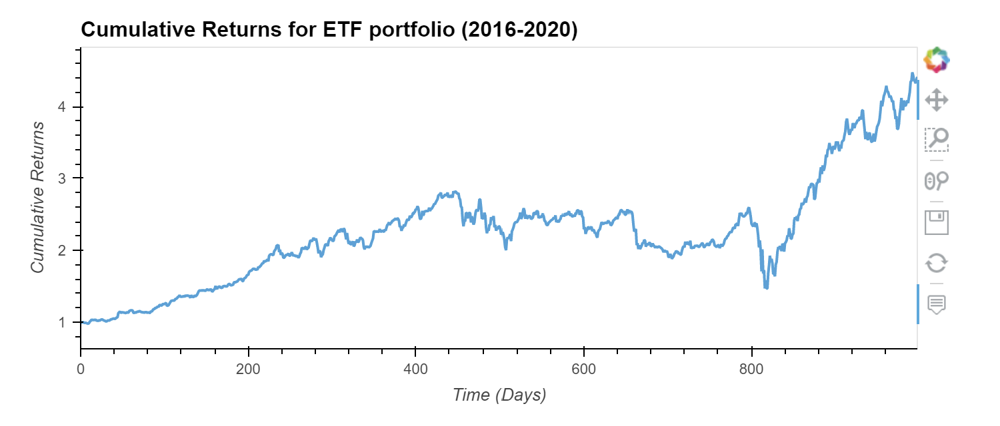

# FinTech ETF Passive Investing 

Passive investing involves investing in a basket of assets which is called an exchange-traded fund (ETF). This way, you don’t spend time researching individual stocks or companies or take the risk of investing in a single stock. ETFs offer more diversification.

This project involves building a financial database and web application by using SQL, Python, and the Voilà library to analyze the performance of a hypothetical fintech ETF.

## Technologies

Programming Languages: Python 3.7.13 & SQL

Interactive Development Environment: JupyterLab


Libraries: 
- Pandas - A Python library that is used for data manipulation, analysis, and visualization. 
- Sqlalchemy - An open-source SQL library for Python designed to ease the communication between Python-based programs and databases. 
- Voilà - A Python library which allows you to convert a Jupyter notebook into a live webpage. 
- Numpy - A popular open-source numerical computing library for Python which provides a powerful array object and a collection of mathematical functions. 
- HvPlot - A Python library that provides a high-level interface for quickly creating interactive plots and visualizations using popular plotting libraries such as Matplotlib, Bokeh, and Plotly.
- Warnings - A Python library that provides a way to handle warning messages that may occur during the execution of a program.

Operating System(s):  Any operating system that supports Python, including Windows & macOS.

## Installation Guide

To run this analysis, make sure you install the necessary dependencies:

1. Install Python: https://www.python.org/downloads/
2. Install and run Jupyter Lab:  https://jupyter.org/install
3. Install Anaconda: https://docs.anaconda.com/free/anaconda/install/
4. Install the necessary libraries using pip, the package installer for Python:
```
pip install pandas numpy hvplot SQLAlchemy
```
To check if sqlalchemy is already installed, run the following command:
```
 conda list sqlalchemy
```
If it is installed, the following should be displayed:


To install Voilà, run the following command:
```
conda install -c conda-forge voila
```
After installation for voila is complete, the following should be displayed:


5. Clone the repository: `git clone "https://github.com/mikenguyenx/7_passive_investing_sql"` using git or download the ZIP file and extract it to a local directory.


## Usage

To run the script for the Fund Portfolio Risk Return Analysis:

1. Open a terminal or command prompt and navigate to the directory with the analysis.
1. Launch Jupyter Lab: jupyter lab
2. Open `etf_analyzer.ipynb` in Jupyter Lab.
3. Run the code cells by clicking on the run button or by pressing the `Shift + Enter` key combination to load and preprocess the data, and generate visualizations
4. This project involves building a financial database and web application by using SQL, Python, and the Voilà library to analyze the performance of a hypothetical fintech ETF.

## Cumulative Returns Interactive Plot



## Web Application Deployment (Voilà) 

[voila_clip.webm](https://github.com/mikenguyenx/7_passive_investing_sql/assets/127016510/6e6791be-6e7a-4e0b-85b2-afb56c43171f)


## Contributors

Mike Nguyen


## License

MIT
